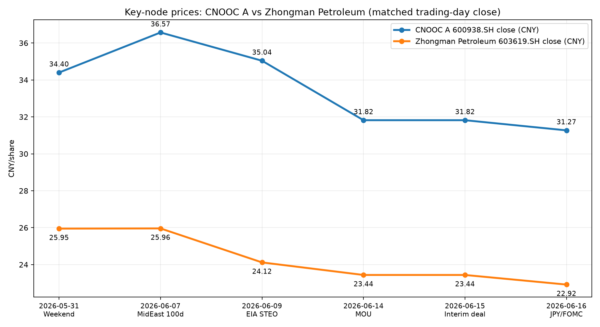

# 中国海油与中曼石油关键节点价格复盘

> 口径说明：用户问“中国海油、中曼石油”，本文按 A 股口径处理，即中国海油 `600938.SH`、中曼石油 `603619.SH`。价格为人民币/股，优先使用节点当天收盘价；若节点为非交易日，则用后一个交易日收盘价近似。本文不是买卖建议，只做“宏观节点—个股价格”的可验证对照。

## 1. 分析结论

1. 2026-05-29 至 2026-06-16 这一段可核验窗口内，中国海油从 34.40 元附近降至 31.27 元，跌幅约 9.10%；中曼石油从 25.95 元附近降至 22.92 元，跌幅约 11.68%。
2. 价格冲击最明显的节点集中在 2026-06-09 至 2026-06-16：对应 EIA 高油价/霍尔木兹假设、6/14–6/15 协议预期、6/16 日元套息与 FOMC 窗口叠加。
3. 两只股票在节点上的方向大体一致，但中曼石油弹性更高：同一窗口内跌幅更大，说明它更像“油价/风险偏好弹性标的”，中国海油更像“高股息大市值油气权重标的”。
4. 2026-07-07、2026-07-28/29、2026-09-30、2026-10 等后续节点在写作日尚未发生，不能填入真实价格，只能列为待跟踪节点。

## 2. 节点价格表

| 原节点日期 | 节点含义 | 价格匹配交易日 | 中国海油 600938.SH 收盘 | 中曼石油 603619.SH 收盘 | 口径说明 |
| ---- | ---- | ---- | ----: | ----: | ---- |
| 2026-05-31 | 周末聊天：波斯湾战争、油粮、通胀主线 | 2026-05-29 | 34.40 | 25.95 | 5/31 为周日，取前一交易日用于观察节点前价格 |
| 2026-06-07 | 周末聊天：中东战争百日，油价被压、油粮未到位 | 2026-06-08 | 36.57 | 25.96 | 6/7 为周日，取后一交易日 |
| 2026-06-09 | EIA 6月 STEO，高油价与霍尔木兹恢复假设 | 2026-06-09 | 35.04 | 24.12 | 节点当天交易日 |
| 2026-06-14 | 巴方宣布美伊 MOU 定稿，协议预期开始抢跑 | 2026-06-15 | 31.82 | 23.44 | 6/14 为周日，取后一交易日 |
| 2026-06-15 | 临时协议公布/市场抢跑 | 2026-06-15 | 31.82 | 23.44 | 节点当天交易日 |
| 2026-06-16 | 日元套息/FOMC 窗口；油价、黄金、美元再定价 | 2026-06-16 | 31.27 | 22.92 | 节点当天交易日 |
| 2026-07-07 | EIA 下一次 STEO，验证油价压制是否改变基本面 | 待发生 | — | — | 后续补数据 |
| 2026-07-28 至 2026-07-29 | FOMC，验证油价回落是否转化为宽松 | 待发生 | — | — | 后续补数据 |
| 2026-09-30 | 美国财政节点 | 待发生 | — | — | 后续补数据 |
| 2026-10 前后 | 关税、发债、资产速冻窗口 | 待发生 | — | — | 后续补数据 |

## 3. 图表

## 4. 逻辑链拆解

| 逻辑链 | 起点 | 传导过程 | 影响资产 | 最容易出错的环节 |
| ---- | ---- | ---- | ---- | ---- |
| 协议压油链 | 2026-06-14 至 2026-06-15 协议预期 | 原油风险溢价回吐 -> 油气股盈利预期和风险偏好同步下修 | 中国海油、中曼石油、油服、油运 | 把“政治协议”误当成“物流和库存已经恢复” |
| 高油价假设链 | 2026-06-09 EIA STEO | 高油价与霍尔木兹恢复假设支撑能源链叙事，但若随后协议抢跑，价格先反向调整 | 原油、能源股 | 只看 EIA 油价假设，不看协议和资本流速 |
| 个股弹性链 | 油价与风险偏好波动 | 大市值高股息油气股波动相对小；油服/民营油气弹性更高 | 中国海油 vs 中曼石油 | 把弹性等同于确定收益，忽略回撤和流动性 |

## 5. 可验证指标

| 观点 | 验证指标 | 数据变化说明什么 | 反向信号 |
| ---- | ---- | ---- | ---- |
| 协议预期压制油气股 | Brent、WTI、油气股指数、600938/603619 收盘价 | 油价与油气股同步下行，说明风险溢价回吐正在传导 | 油价跌但油气股抗跌，说明股价更看股息/估值 |
| 中曼石油弹性更高 | 两股相对涨跌幅、成交额、换手率 | 中曼涨跌幅持续大于中国海油，说明风险偏好属性更强 | 两股涨跌幅收敛，说明个股因素或行业因子减弱 |
| 7月节点需要再验证 | 2026-07-07 EIA、7月库存、7月 FOMC、Brent 期限结构 | 基本面和政策确认后，才能判断“油气链转身”是否成立 | 库存继续去化、期限结构仍强，则价格回落可能是假转身 |

## 6. 风险与反例

1. 数据风险：本文只使用 Investing.com 页面可见的近期日线数据；若交易所、Wind、Choice、同花顺或东方财富复权口径不同，节点价格可能有小幅差异。
2. 口径风险：中国海油也有港股 `0883.HK`，本文按 A 股 `600938.SH` 处理；若用户想看港股，需要单独重做港币口径图表。
3. 事件归因风险：节点附近股价变化不一定只由宏观事件驱动，也可能受分红、财报、行业研报、指数调仓、资金面和个股公告影响。
4. 交易风险：能源股并不等于油价本身；油价上涨也可能因成本、税费、政策、需求破坏或市场风险偏好下降而无法线性传导到股价。

## 7. 后续观察清单

- 2026-07-07：补入 EIA STEO 当日或后一交易日的 600938、603619 收盘价，并同步记录 Brent/WTI。
- 2026-07-28 至 2026-07-29：补入 FOMC 节点前后两股价格，观察降息预期是否改善风险偏好。
- 2026-09-30 与 2026-10：补入财政/关税/速冻窗口价格，用于判断油气股是跟随油价、美元流动性，还是跟随 A 股风险偏好。

## 8. 出处说明

- 出处：docs/timeline/2026-06-16_卢麒元框架关键时间节点_宏观事件整理.md，日期：2026-06-16，主题：卢麒元框架关键时间节点。
- 出处：docs/timeline/2026-06-19_和平协议与议息关键节点_宏观事件整理.md，日期：2026-06-16，主题：美伊和平协议与 FOMC 节点。
- 出处：docs/timeline/2026-06-16_原油7月转身关键节点_宏观事件整理.md，日期：2026-06-16，主题：原油 7 月转身关键节点。
- 出处：Investing.com 中国海油 600938 历史数据页，页面显示 2026-05-18 至 2026-06-16 日线收盘、开盘、最高、最低、成交量、涨跌幅。
- 出处：Investing.com 中曼石油 603619 历史数据页，页面显示 2026-05-18 至 2026-06-16 日线收盘、开盘、最高、最低、成交量、涨跌幅。
